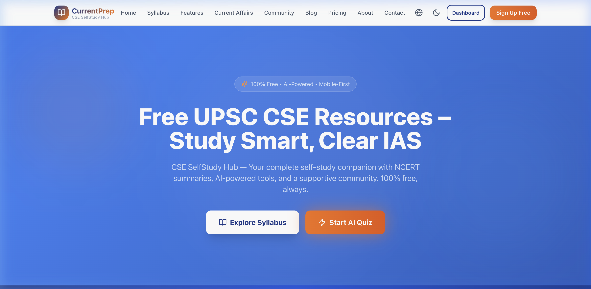
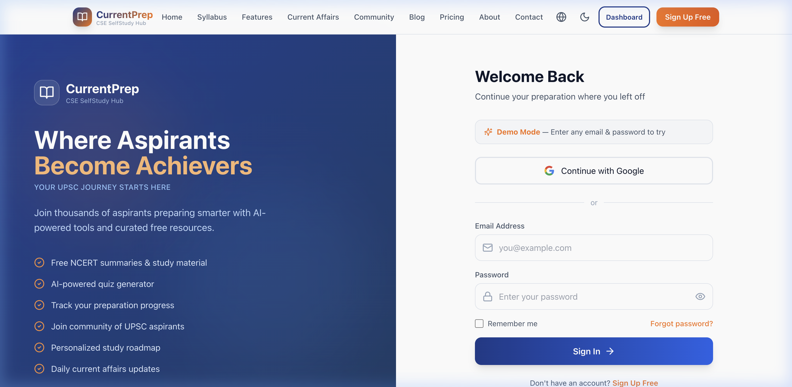
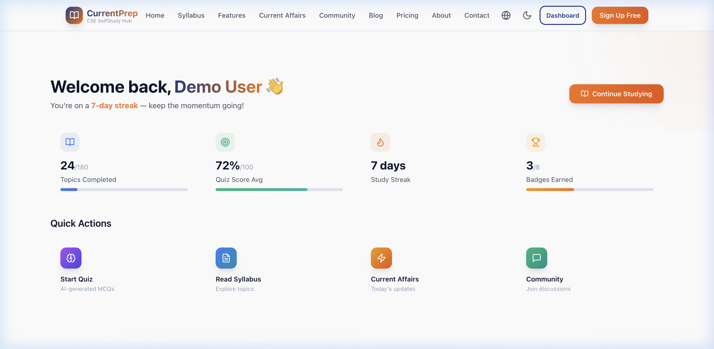
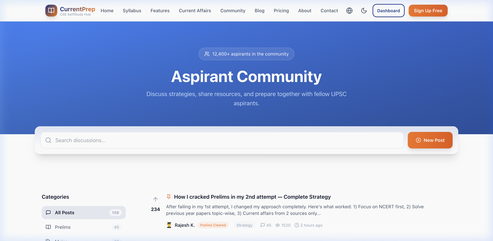
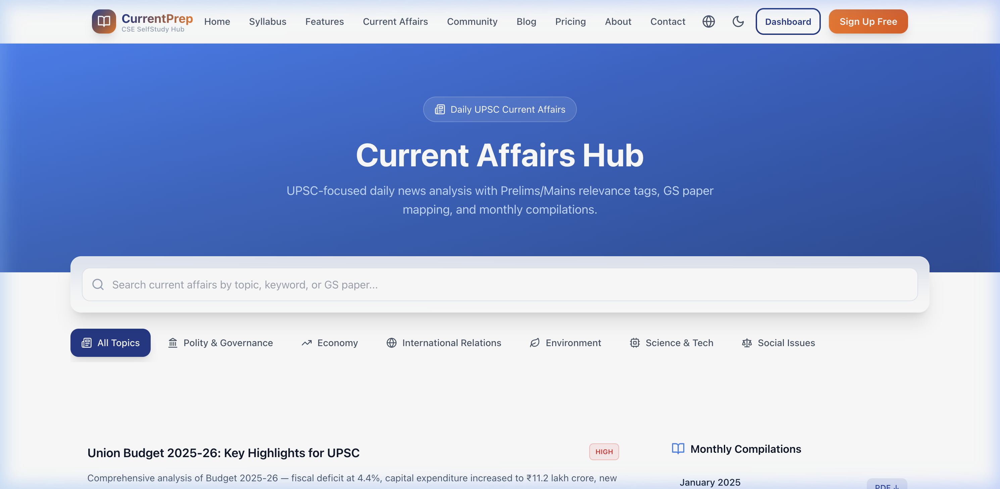

<p align="center">
  
  
  
  
  
</p>

<h1 align="center">📚 CurrentPrep</h1>
<h3 align="center"><em>Where Aspirants Become Achievers</em></h3>
<p align="center">CSE SelfStudy Hub — Free, AI-Powered UPSC Civil Services Exam Preparation Platform</p>

<p align="center">
  <a href="#-features">Features</a> •
  <a href="#-screenshots">Screenshots</a> •
  <a href="#-tech-stack">Tech Stack</a> •
  <a href="#-getting-started">Getting Started</a> •
  <a href="#-project-structure">Structure</a> •
  <a href="#-roadmap">Roadmap</a>
</p>

---

## 🎯 About

**CurrentPrep** is a free, open-source, self-study platform for UPSC Civil Services Exam aspirants. Built with a **Blue Ocean Strategy** — we eliminate expensive coaching barriers and create accessible, AI-enhanced learning tools for students across India.

### Why CurrentPrep?

- 🆓 **Free Forever** — Core content is always free. No paywalls on essential resources.
- 🤖 **AI-Powered** — Smart quiz generator, answer checker, personalized study roadmaps.
- 🌐 **Bilingual** — Seamless English ↔ Tamil language switching (more languages coming).
- 📱 **Mobile-First PWA** — Install on any phone, works offline.
- 🌙 **Dark Mode** — Study comfortably at any hour.
- 👥 **Community Driven** — Forum for aspirants to discuss, share, and support each other.

---

## 📸 Screenshots

### Homepage


### Login / Sign Up


### Dashboard


### Community Forum


### Current Affairs


---

## ✨ Features

| Feature | Description |
|---------|-------------|
| 📖 **Syllabus Hub** | Complete UPSC Prelims & Mains syllabus with NCERT summaries, topic trees, and PDF links |
| 🧠 **AI Quiz Generator** | Practice MCQs generated from specific topics, mimicking UPSC patterns |
| 📊 **Progress Dashboard** | Track topics completed, quiz scores, study streaks, and earned badges |
| 📰 **Current Affairs** | Daily news analysis with Prelims/Mains relevance tags and GS paper mapping |
| 💬 **Community Forum** | Discussion threads with categories, upvotes, and peer mentorship |
| ⏱️ **Study Timer** | Built-in Pomodoro-style timer with walking break reminders |
| 🔐 **Authentication** | Secure login with NextAuth (demo mode + Google OAuth ready) |
| 🌍 **Bilingual** | Full English & Tamil support with instant language switching |
| 🌙 **Dark/Light Mode** | Theme toggle with system preference detection |
| 📱 **PWA Support** | Installable on mobile, with service worker for offline access |
| 💰 **Freemium Model** | Free tier + optional Premium (₹299/mo) for advanced AI tools |

---

## 🛠️ Tech Stack

| Layer | Technology |
|-------|------------|
| **Framework** | [Next.js 14](https://nextjs.org/) (App Router) |
| **Language** | [TypeScript](https://www.typescriptlang.org/) |
| **Styling** | [Tailwind CSS](https://tailwindcss.com/) + Custom CSS variables |
| **Animations** | [Framer Motion](https://www.framer.com/motion/) |
| **Icons** | [Lucide React](https://lucide.dev/) |
| **Authentication** | [NextAuth.js](https://next-auth.js.org/) |
| **Database** | [Supabase](https://supabase.com/) (PostgreSQL) |
| **Fonts** | Google Fonts (Inter + Outfit) |
| **PWA** | Custom Service Worker + Web Manifest |

---

## 🚀 Getting Started

### Prerequisites

- **Node.js** 18+ ([download](https://nodejs.org/))
- **npm** or **yarn**

### Installation

```bash
# Clone the repository
git clone https://github.com/MGTVALAVAN/CurrentPrep.git
cd CurrentPrep

# Install dependencies
npm install

# Set up environment variables
cp .env.local.example .env.local
# Edit .env.local with your values (see Environment Variables below)

# Start development server
npm run dev
```

Open [http://localhost:3000](http://localhost:3000) in your browser.

### Environment Variables

Create a `.env.local` file in the root directory:

```env
# NextAuth
NEXTAUTH_URL=http://localhost:3000
NEXTAUTH_SECRET=your-secret-key-here

# Supabase (optional — for database integration)
NEXT_PUBLIC_SUPABASE_URL=https://your-project.supabase.co
NEXT_PUBLIC_SUPABASE_ANON_KEY=your-anon-key

# Google OAuth (optional — for Google login)
GOOGLE_CLIENT_ID=your-google-client-id
GOOGLE_CLIENT_SECRET=your-google-client-secret
```

> **Note:** The app runs in **demo mode** by default — any email/password combination works for testing.

### Build for Production

```bash
npm run build
npm start
```

---

## 📁 Project Structure

```
CurrentPrep/
├── public/
│   ├── manifest.json          # PWA configuration
│   └── sw.js                  # Service worker for offline support
├── src/
│   ├── app/
│   │   ├── page.tsx           # Homepage
│   │   ├── layout.tsx         # Root layout with SEO metadata
│   │   ├── globals.css        # Design system & CSS variables
│   │   ├── login/             # Login & signup page
│   │   ├── dashboard/         # User progress dashboard
│   │   ├── syllabus/          # UPSC syllabus hub
│   │   ├── features/          # Platform features showcase
│   │   ├── pricing/           # Free & premium plans
│   │   ├── blog/              # Preparation blog
│   │   ├── community/         # Discussion forum
│   │   ├── current-affairs/   # Daily news analysis
│   │   ├── about/             # About page
│   │   ├── contact/           # Contact & FAQ
│   │   └── api/auth/          # NextAuth API routes
│   ├── components/
│   │   ├── Navbar.tsx         # Navigation bar
│   │   ├── Footer.tsx         # Site footer
│   │   └── ClientProviders.tsx # Theme & language providers
│   ├── contexts/
│   │   ├── ThemeProvider.tsx   # Dark/light mode context
│   │   └── LanguageProvider.tsx # Bilingual context (EN/TA)
│   └── data/
│       ├── translations.ts    # i18n translation strings
│       └── syllabusData.ts    # UPSC syllabus data
├── supabase/
│   └── schema.sql             # Database schema
├── docs/
│   └── screenshots/           # App screenshots
├── tailwind.config.ts         # Tailwind CSS configuration
├── next.config.mjs            # Next.js configuration
└── package.json
```

---

## 🗄️ Database Schema

The Supabase PostgreSQL schema includes tables for:

| Table | Purpose |
|-------|---------|
| `users` | User profiles and preferences |
| `progress` | Topic-wise completion tracking |
| `forum_posts` | Community discussion threads |
| `forum_replies` | Replies to forum posts |
| `quiz_attempts` | Quiz scores and history |
| `badges` | Gamification achievement badges |
| `study_sessions` | Study time tracking |

See [`supabase/schema.sql`](supabase/schema.sql) for the full schema.

---

## 📄 Pages

| Route | Page | Description |
|-------|------|-------------|
| `/` | Home | Hero, features, testimonials, stats, CTA |
| `/login` | Login/Signup | Auth form with demo mode, Google OAuth |
| `/dashboard` | Dashboard | Progress, streaks, timer, badges, quick actions |
| `/syllabus` | Syllabus Hub | Prelims & Mains syllabus with topic trees |
| `/features` | Features | Platform capabilities showcase |
| `/pricing` | Pricing | Free vs Premium plan comparison |
| `/blog` | Blog | Preparation tips and strategy guides |
| `/community` | Community | Forum with categories, posts, contributors |
| `/current-affairs` | Current Affairs | Daily news with UPSC relevance mapping |
| `/about` | About | Mission, team, Blue Ocean strategy |
| `/contact` | Contact | Contact form + FAQ accordion |

---

## 🗺️ Roadmap

- [x] Core pages (Home, Syllabus, Features, Pricing, Blog, About)
- [x] Authentication (NextAuth with demo mode)
- [x] Dashboard with progress tracking
- [x] Community forum
- [x] Current affairs page
- [x] Dark/Light theme
- [x] Bilingual support (EN/TA)
- [x] PWA with service worker
- [x] Contact page with FAQ
- [ ] Supabase integration for data persistence
- [ ] AI quiz generator backend
- [ ] Google OAuth integration
- [ ] Hindi, Telugu, Kannada language support
- [ ] Blog post detail pages
- [ ] Syllabus topic detail pages
- [ ] Push notifications for current affairs
- [ ] Answer writing practice module
- [ ] Mentorship matching system

---

## 🤝 Contributing

Contributions are welcome! Please feel free to submit a Pull Request.

1. Fork the repository
2. Create your feature branch (`git checkout -b feature/amazing-feature`)
3. Commit your changes (`git commit -m 'Add amazing feature'`)
4. Push to the branch (`git push origin feature/amazing-feature`)
5. Open a Pull Request

---

## 📜 License

This project is licensed under the MIT License — see the [LICENSE](LICENSE) file for details.

---

## 🙏 Acknowledgements

- [NCERT](https://ncert.nic.in/) for free educational content
- [UPSC](https://upsc.gov.in/) for official syllabus and resources
- The UPSC aspirant community for inspiration and feedback

---

<p align="center">
  Made with ❤️ in Chennai, India 🇮🇳
  <br />
  <strong>CurrentPrep</strong> — Where Aspirants Become Achievers
</p>
